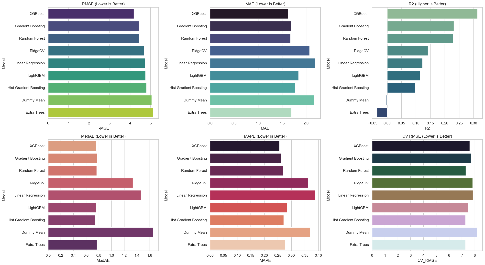
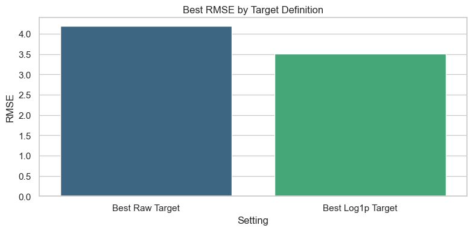
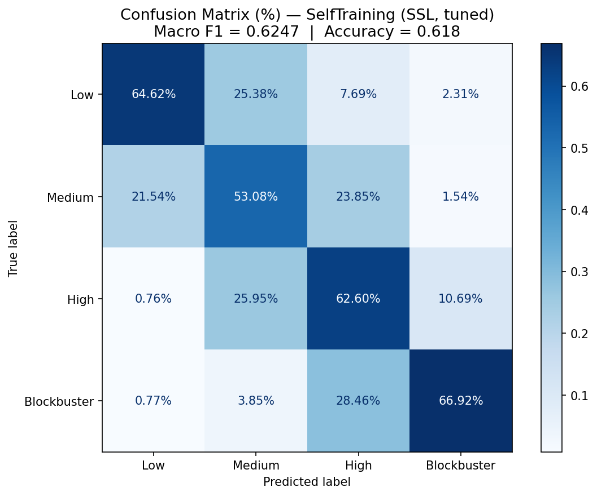
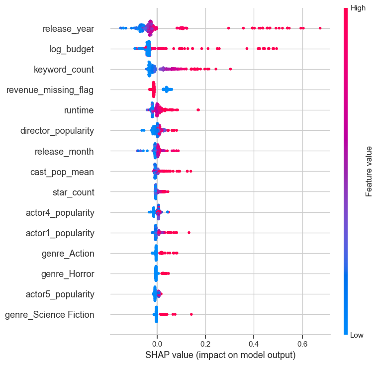

# 🎬 The Next Blockbuster
### Predicting movie success before the cameras roll

[](https://tmdbmoviesblockbuster.streamlit.app/)
[](https://www.python.org/)
[](https://scikit-learn.org/)
[](https://www.themdb.org/)

> *80% of films don't turn a profit despite massive production costs. This project asks: what if you could predict that before spending a dollar?*

Built by **Group 1** · McGill University INSY 674 · Laura Manzanos, Maria Jose Beletanga, Emmanuel Okerein, Hank Shao, Ibukun Adeleye

---

## What it does

A pre-release decision-support system that answers two questions using only information available **before a film is released**:

| Question | Approach | Best model |
|---|---|---|
| How popular will this movie be? | Supervised regression | Gradient Boosting + log₁ₚ target · R² **0.52** |
| What revenue tier will it hit? | Semi-supervised classification | Self-Training (SSL) · Macro F1 **0.625** |

The results power a **Streamlit casting sandbox** where studio teams can run what-if scenarios: swap directors, adjust cast, change release timing, and instantly see predicted outcomes.

---

## The app

**[→ Try it live](https://tmdbmoviesblockbuster.streamlit.app/)**

Built with a cinematic dark/gold aesthetic. Inputs include director, top-5 cast, genre, language, runtime, release timing, and budget proxy. Outputs:

- 📊 Predicted popularity score with percentile context
- 💰 Revenue tier (Low / Medium / High / Blockbuster) with class confidence
- ⭐ Composite casting fit score
- 🎭 TMDB "known for" enrichment panels for each cast member

---

## How it was built

### 1. Data — 9,290 movies from TMDB (2010–2025)

- Extracted via TMDB API: movies, top-billed cast, directors, genres, keywords, metadata
- **9,290 movies** total · only **~2,600 have revenue labels** (~28%) — the rest are unlabeled
- Zero-corrected: budget/revenue = 0 treated as missing, not true $0
- Strict leakage prevention: no post-release metrics in any feature matrix

### 2. Feature engineering

| Category | Key features |
|---|---|
| Talent | `director_popularity`, `cast_pop_mean`, `cast_pop_max`, `star_count` (actors above 75th percentile) |
| Temporal | `release_month`, `is_summer_release`, `is_holiday_release`, release year |
| Content | 19 genre binary flags, `keyword_count`, language flags |
| Production | `log_budget` (log1p-transformed), `runtime`, overview length signals |

### 3. Popularity model — supervised regression

Benchmarked 9 model families from Dummy to XGBoost/LightGBM. Key finding: **log₁ₚ-transforming the target and back-transforming predictions with expm1 improved R² from 0.31 → 0.52.**





**Final exported model:** Gradient Boosting trained on `log1p(popularity)`

| Metric | Raw XGBoost | **Final (GB + log1p)** |
|---|---|---|
| RMSE | 4.185 | **3.507** |
| MAE | 1.626 | **1.420** |
| R² | 0.314 | **0.519** |

### 4. Revenue tier model — semi-supervised learning

With only ~28% of movies having revenue labels, purely supervised models leave most of the data on the table. Semi-supervised learning (SSL) uses the unlabeled pool to improve classification.

**Setup:** 60/20/20 stratified train/val/test split on labeled data only. Scaler fitted on train set only. Unlabeled pool (~6,600 movies) used for pseudo-labeling — never for evaluation.

**Three SSL approaches tested:**
- Self-Training with Random Forest base estimator (confidence threshold = 0.7)
- Label Spreading (KNN graph)
- Label Propagation (KNN graph)

**Best model: Self-Training (tuned RF) — Macro F1 0.6247**, pseudo-labeling 5,968 unlabeled samples.



| Model | Accuracy | Macro F1 |
|---|---|---|
| **SelfTraining SSL (tuned)** ✅ | **0.618** | **0.625** |
| Random Forest (supervised) | 0.616 | 0.617 |
| Gradient Boosting (supervised) | 0.603 | 0.603 |
| Label Spreading | 0.547 | 0.542 |
| Label Propagation | 0.528 | 0.528 |

### 5. Explainability — SHAP



Top drivers of predicted popularity: **release year, log budget, keyword count, runtime, and director popularity** — all signals available before release day.

---

## Repository structure

```
INSY 674 FinalProject/
├── app/
│   └── app_final.py              # Streamlit casting sandbox
├── notebooks/
│   ├── DataExtraction.ipynb      # TMDB API ingestion
│   └── FeatureEngineering.ipynb  # Leakage-safe feature pipeline
├── EDA/
│   └── EDA.ipynb                 # Exploratory data analysis
├── models/
│   ├── PopularityModelComparison.ipynb   # Regression benchmarking + SHAP
│   ├── SemiSupervisedModels_Final.ipynb  # SSL modeling
│   └── export_best_models.py             # Model export for app
├── data/                         # Processed datasets + model artifacts
├── images/                       # Key result visuals
└── requirements.txt
```

---

## Key results at a glance

- ✅ Pre-release signals **can** meaningfully predict movie outcomes
- 📈 Log-transforming the popularity target **cut RMSE by 16%** and **nearly doubled R²**
- 🤖 Semi-supervised learning **outperformed all purely supervised models** by leveraging 6K+ unlabeled movies
- 🎯 Graph-based SSL (Label Propagation/Spreading) underperformed — high-dimensional feature spaces break neighborhood assumptions without PCA
- 🏆 **Release timing, budget, keyword richness, and director popularity** are the strongest pre-release signals

---

## Run it locally

```bash
git clone https://github.com/YOUR_USERNAME/INSY-674-FinalProject.git
cd "INSY 674 FinalProject"

python -m venv .venv
source .venv/bin/activate
pip install -r requirements.txt

streamlit run app/app_final.py
```

Set your TMDB API key as an environment variable: `export TMDB_API_KEY=your_key_here`

---

## Tech stack

`Python 3.12` · `scikit-learn` · `XGBoost` · `LightGBM` · `SHAP` · `Streamlit` · `Altair` · `pandas` · `TMDB API`

---

<div align="center">

*Made with 🎬 and a love for data-driven storytelling*

</div>
